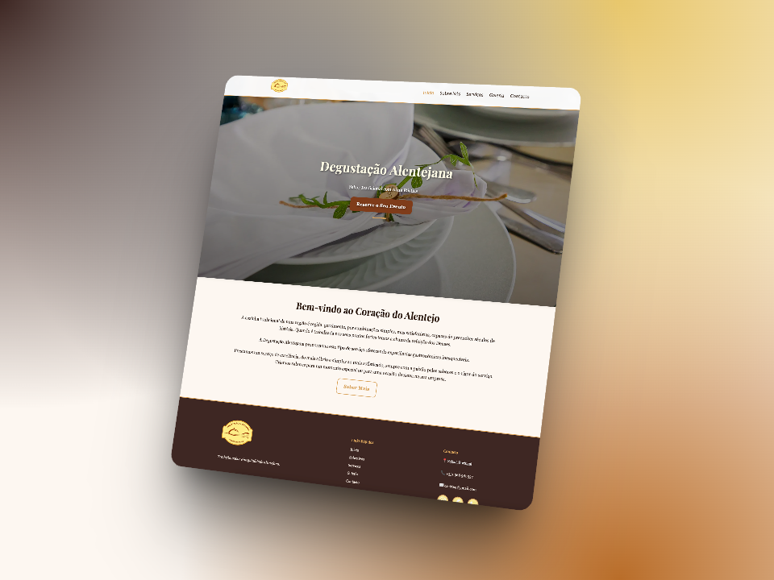

# Degustação Alentejana

[](https://degustacaoalentejana.pt)
[](https://github.com/diogocaeiro02/degustacaoalentejanaweb)
[](https://github.com/diogocaeiro02/degustacaoalentejanaweb)

> Website for **Degustação Alentejana**, a traditional Alentejo-style catering company located in Seixal, Portugal. This static website showcases the company’s services, gallery, contact form, and background, providing a user-friendly and visually engaging experience.

## 📸 Preview



---

## 🌐 Live Preview

🔗 [View Website](https://degustacaoalentejana.pt)

---

## 📄 Project Overview

This project is a static website built using:

- **HTML5**
- **CSS3** (Modular with variables and media queries)
- **JavaScript** (vanilla)
- **[Lightbox2](https://lokeshdhakar.com/projects/lightbox2/)** for image viewing
- **EmailJS** for contact form integration

### ✨ Key Features:

- Full-screen **Hero Section** with background image
- Animated **scroll effects**
- **Responsive design** for desktop, tablet, and mobile
- **CTA button** leading to the contact section
- **Lightbox2** integration for gallery
- Clean **favicon** setup

---

## 📂 Folder Structure

```
repo/ │
      ├── index.html
      ├── about.html
      ├── services.html
      ├── gallery.html
      ├── contact.html
      │
      ├── styles/
      │       ├── main.css
      │       ├── base.css
      │       ├── navbar.css
      │       ├── hero.css
      │       ├── buttons.css
      │       ├── gallery.css
      │       ├── about.css
      │       ├── contact.css
      │       ├── services.css
      │       ├── footer.css
      │       └── responsive.css
      │
      ├── assets/
      │      ├── images
      │      ├── logo
      │      └── icons
      │
      └── scripts / main.js
```

---

## 🚀 How to Run Locally

1. **Clone** the repository:
   ```bash
   git clone https://github.com/diogocaeiro02/DegustacaoAlentejanaWeb
   ```
2. **Navigate** into the project directory.
3. **Open** the `index.html` file directly in your browser.

No frameworks, servers, or installations needed.

---

## 🔧 To Do

- [ ] Add smooth scroll between page sections
- [ ] Integrate Google Analytics
- [ ] Add service-specific landing pages (optional)

---

## 🛠️ Credits

- Developed by [Diogo Caeiro](https://diogocaeiro.pt)

---

## 📜 License

This project is proprietary and was developed exclusively for a client.  
Unauthorized copying, modification, or distribution is not permitted without explicit permission.

---
